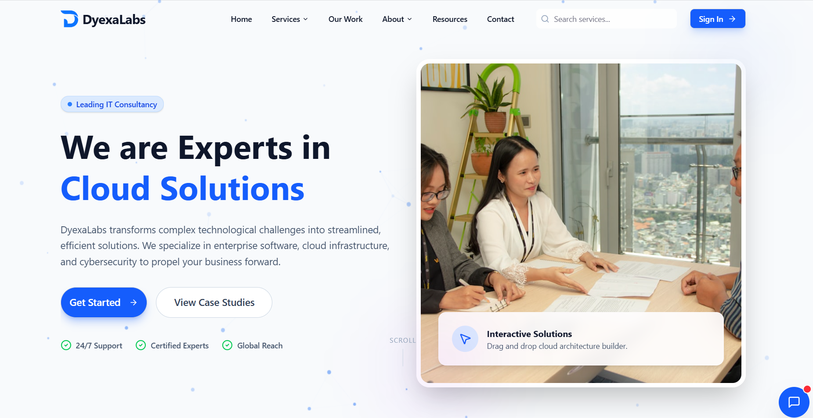

# 🌐 DyexaLabs — IT Consulting & Digital Solutions



DyexaLabs is a modern, enterprise-oriented IT consulting website built with **Vite, React, and TypeScript**. Designed with a clean **light-only theme**, the platform focuses on clarity, trust, scalability, and conversion—representing a professional digital presence for an IT consulting business.

---

## 🏢 About DyexaLabs

**DyexaLabs** is an IT consulting and digital solutions brand providing technology-focused services, strategic insights, and professional consultation for businesses and organizations.

The website is designed to immediately establish credibility by displaying the company name, identity, and core message **above the fold**, ensuring visitors instantly recognize they are on the correct platform—without needing to scroll.

This project originated from an English course assignment and has evolved into a fully structured, enterprise-style IT consulting website.

---

## ✨ Core Features & Business Components

This website includes all essential elements expected from a **large business IT consulting platform**:

### 🔹 Branding & Identity
- Prominent **DyexaLabs** company name
- Professional logo placement
- Clear company description and tagline

### 🔹 Navigation & Usability
- Dynamic and interactive navigation bar
- Persistent navigation across pages
- **Global search bar** for fast content discovery

### 🔹 Call-To-Actions (CTAs)
- Book a consultation
- Request a demo
- Contact the team
- Subscribe for updates

Designed to guide visitors toward meaningful engagement and lead generation.

### 🔹 Visual & Media Content
- Professional, business-focused visuals
- Clean light-theme UI
- Strong visual hierarchy for readability

### 🔹 Internal Linking
- Structured internal navigation
- Service highlights linked to detailed pages
- Blog or insight routing readiness

### 🔹 Testimonials
- Client feedback and social proof
- Trust-building testimonial section on the homepage

### 🔹 Live Chat (BETA)
- Real-time visitor communication
- Trigger-based engagement after time-on-page

### 🔹 Subscriber Opt-In
- Newsletter subscription form
- Homepage lead capture
- Exit-intent or interaction-based prompts

---

## 🛠️ Tech Stack

### Core
- **Vite** — Fast build tool and development server
- **React** — Component-based UI architecture
- **TypeScript** — Type-safe and scalable JavaScript

### Styling & UI
- **Tailwind CSS** — Utility-first styling
- Global light theme
- Reusable UI components

### Tooling
- ESLint for code quality
- PostCSS for CSS processing
- Modern ES module architecture

---

## 📂 Project Structure

```txt
dyexalabs/
├── public/
├── src/
│   ├── assets/            # Static assets (images, icons, media)
│   ├── components/        # Reusable components
│   │   ├── auth/          # Authentication-related components
│   │   ├── common/        # Shared/common components
│   │   ├── effects/       # Visual & interaction effects
│   │   ├── home/          # Homepage-specific components
│   │   ├── layout/        # Layout and structural components
│   │   └── ui/            # UI primitives and design system
│   ├── data/              # Static or mock data
│   ├── pages/             # Page-level components
│   ├── styles/
│   │   └── globals.css    # Global styles and theme
│   ├── App.tsx            # Root React component
│   ├── main.tsx           # Application entry point
│   └── declarations.d.ts  # TypeScript declarations
├── index.html
├── preview.png
├── vite.config.ts
├── tailwind.config.js
├── postcss.config.js
├── tsconfig.json
├── tsconfig.app.json
├── eslint.config.js
├── package.json
└── README.md
````

---

## 🚀 Getting Started

### Prerequisites

* **Node.js 18+**
* npm / pnpm / yarn

### Installation

```bash
npm install
```

### Development

```bash
npm run dev
```

### Production Build

```bash
npm run build
```

---

## 🌍 Live Website

🔗 **[https://dyexalabs.netlify.app](https://dyexalabs.netlify.app)**

---

## 🎯 Project Objectives

* Build a **large-scale IT consulting website**
* Establish professional credibility and trust
* Improve navigation and content discovery
* Encourage business inquiries and conversions
* Provide a scalable foundation for future growth

---

## 🔮 Future Enhancements

* CMS or API-driven content
* SEO and analytics integration
* Blog and insight expansion
* Authentication and client portals
* Multi-language support

---

## 📄 License

This project is licensed under the **MIT License**.

---

## 👤 Author

**Dyexa Rahardika**

Built and maintained as a professional web development project.

---

⭐ If you find this project useful or inspiring, consider starring the repository.
